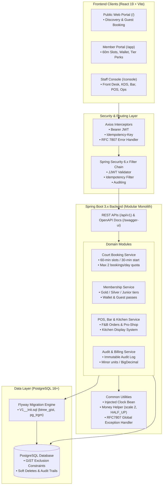

# 🏆 Champions Club — Sports Club Management System

[](https://github.com/champions-club/champions-club-management-system/actions/workflows/ci.yml)
[](LICENSE)
[](https://openjdk.org/projects/jdk/21/)
[](https://spring.io/projects/spring-boot)
[](https://react.dev)
[](https://tailwindcss.com)

**Champions Club** is an enterprise-grade, high-performance Sports Club Management System engineered for sports clubs, athletic centers, and multi-sport complexes. The system seamlessly unifies court reservations, membership tier management, pro-shop inventory, food & beverage point-of-sale, coaching sessions, and financial auditing into a real-time, responsive platform.

---

## 🏛 System Architecture



---

## 🚀 Key Non-Negotiable Rules

1. **Database-Level Double Booking Guard:** PostgreSQL GiST exclusion constraints are the final, authoritative defense against concurrent court booking race conditions.
2. **Monetary Safety:** All currency calculations strictly use `BigDecimal` with 2 decimal places and `HALF_UP` rounding (or minor units). No `float` or `double`.
3. **UTC Time Persistence:** Stored as UTC `Instant`; day boundaries computed in club timezone (`Asia/Kolkata`).
4. **Idempotency Headers:** Mutating payments, bookings, and orders require an `Idempotency-Key` header to prevent duplicate execution.
5. **Strict Flyway Migrations:** Hibernate `ddl-auto` is disabled (`validate`/`none`). All schema changes are versioned via Flyway.
6. **Soft Deletion:** Referenced operational records maintain referential integrity via soft deletes.
7. **Comprehensive Test Suite:** Every module includes unit tests, Testcontainers PostgreSQL integration tests, and frontend test coverage.

---

## 📁 Repository Structure

```
champions-club-management-system/
├── backend/                       # Spring Boot 3.x Backend (Java 21, Maven)
│   ├── src/main/java/com/championsclub/
│   │   ├── common/                # Security, RFC7807 Error handling, Audit, Money, Time, Idempotency
│   │   ├── court/                 # Court booking module (api, service, domain, repo, dto)
│   │   ├── member/                # Membership and tier module
│   │   └── pos/                   # Point-of-Sale, Bar & Kitchen module
│   ├── src/main/resources/
│   │   ├── db/migration/          # Flyway migration scripts (V1__init.sql)
│   │   ├── application.yml        # Base configuration
│   │   ├── application-dev.yml    # Dev profile
│   │   ├── application-test.yml   # Test profile (Testcontainers)
│   │   └── application-prod.yml   # Prod profile (Neon SSL support)
│   └── src/test/java/             # Unit and Testcontainers smoke tests
├── frontend/                      # React 19 + Vite SPA
│   ├── src/
│   │   ├── api/                   # Axios client with auth interceptor & RFC 7807 parser
│   │   ├── components/            # Reusable UI components & layouts
│   │   ├── pages/
│   │   │   ├── public/            # Public discovery & guest booking (/)
│   │   │   ├── member/            # Member dashboard & bookings (/app)
│   │   │   └── staff/             # Staff operations & KDS (/console)
│   │   └── test/                  # Vitest and RTL component tests
├── docs/                          # Architectural context and specs
│   └── PROJECT_CONTEXT.md         # Full club context and business rules
└── .github/                       # CI workflows, PR and issue templates
```

---

## 🛠 Local Setup & Running

### Prerequisites
- **Java 21 LTS**
- **Maven 3.9+** (or included `mvnw`)
- **Node.js 20+** and **npm**
- **Docker** (for Testcontainers during integration tests)

### 1. Backend

```bash
cd backend
# Copy environment file
cp .env.example .env

# Run all tests (including Flyway + Testcontainers integration tests)
mvn clean test

# Run application locally
mvn spring-boot:run -Dspring-boot.run.profiles=dev
```
- Health Check: `http://localhost:8080/actuator/health`
- OpenAPI Swagger UI: `http://localhost:8080/swagger-ui/index.html`

### 2. Frontend

```bash
cd frontend
# Install dependencies
npm install

# Run unit tests
npm run test:run

# Run development server
npm run dev
```
- Local URL: `http://localhost:5173`
- Public Portal: `http://localhost:5173/`
- Member App: `http://localhost:5173/app`
- Staff Console: `http://localhost:5173/console`

---

## 🧪 Testing Suite

- **Backend Unit & Integration Tests:**
  ```bash
  cd backend && mvn test
  ```
- **Frontend Vitest Tests:**
  ```bash
  cd frontend && npm run test:run
  ```
- **Frontend Production Build:**
  ```bash
  cd frontend && npm run build
  ```

---

## 📄 License
This project is licensed under the [MIT License](LICENSE).
